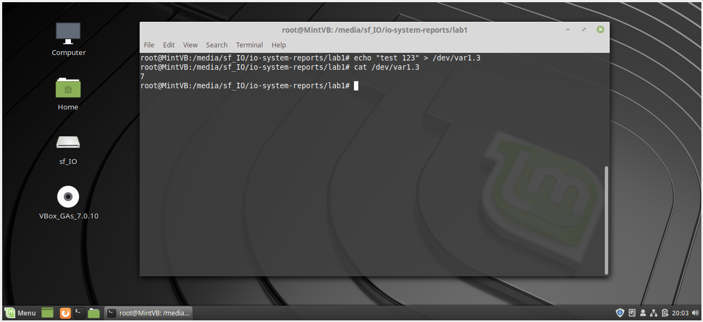
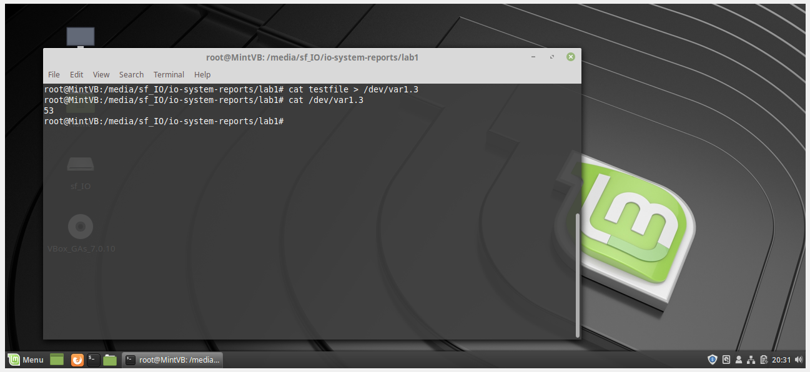

# Лабораторная работа 1

**Название:** "Разработка драйверов символьных устройств"

**Цель работы:** получить знания и навыки разработки драйверов символьных устройств для операционной системы Linux.

**Задачи:**

1. Написать драйвер символьного устройства, удовлетворяющий 
требованиям:

	1.1 Драйвер должен создавать символьное устройство /dev/varN, где N – это номер варианта.

	1.2 Должен обрабатывать операции записи и чтения в соответствии с вариантом задания (варианты представлены ниже)


## Описание функциональности драйвера

**Вариант 1.3**

При записи текста в файл символьного устройства  осуществляется подсчет введенных символов. Последовательность полученных результатов (количество символов) с момента загрузки модуля ядра выводится при чтении файла.

При каждой записи в это устройство cчитаем новое количество символов (полезные - буквы/цифры/знаки - с 33 по 126 включительно по таблице ASCII) и при чтении выводим это значение.

## Инструкция по сборке

```
git clone https://github.com/Deltaspace0/io-system-reports.git
cd lab1
sudo su
make clean
make all
insmod ch_drv.ko
```

## Инструкция пользователя

```
sudo su
echo "test 123" > /dev/var1.3
cat /dev/var1.3
```

## Примеры использования


