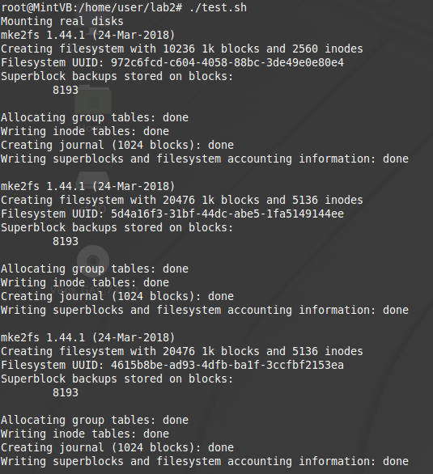

# Лабораторная работа 2

**Вариант**: 1

**Выполнил:** Ермаков Тимофей, гр. P33092

**Название:** "Разработка драйверов блочных устройств"

**Цель работы:** получить знания и навыки разработки драйверов блочных устройств для операционной системы Linux.

## Описание функциональности драйвера

### 1.1, 1.2

Драйвер создаёт виртуальный жесткий диск в оперативной памяти с размером 50 Мбайт. 

Созданный диск разбит на разделы - один первичный раздел размером 10 Мбайт (mydisk1) и один расширенный раздел (mydisk2), содержащий два логических раздела размером 20 Мбайт каждый (mydisk5, mydisk6).

Каждый записываемый байт возводится в квадрат.

### 1.3, 1.4

test.sh монтирует диски, создаёт/удаляет тестовые файлы, измеряет скорость передачи данных при копировании файлов между разделами созданного виртуального диска и между разделами виртуального и реального жестких дисков.


## Инструкция по сборке

### 1.1, 1.2
```
make all
sudo su
insmod main.ko
```
```
rmmod main.ko
make clean
```
### 1.3, 1.4
```
make all
sudo su
insmod main2.ko
```
```
rmmod main2.ko
make clean
```
## Инструкция пользователя

### 1.1, 1.2

Просмотр информации о разметке дисков
```
sudo fdisk -l
```
Проверка возведения записываемого байта в квадрат
```
echo "3" | dd of=/dev/mydisk
hexdump -n 512 /dev/mydisk
```

| ASCII HEX | SYMBOL |
| --------- | ------ |
| 0x30      | 0      |
| 0x31      | 1      |
| 0x32      | 2      |
| 0x33      | 3      |
| 0x34      | 4      |
| 0x35      | 5      |
| 0x36      | 6      |
| 0x37      | 7      |
| 0x38      | 8      |
| 0x39      | 9      |

### 1.3, 1.4

```
./test.sh
```

## Примеры использования

### 1.1, 1.2


### 1.3, 1.4




### Скорости передачи данных (MiB/s)

| Размер файла | N тестов | Виртуальный -> Виртуальный | Виртуальный -> Реальный | Реальный -> Виртуальный |
| ------------ | -------- | -------------------------- | ----------------------- | ----------------------- |
| 1 MiB        | 3        | 1084                       | 595                     | 1090                    |
| 4 MiB        | 3        | 1044                       | 927                     | 1249                    |
| 7 MiB        | 3        | 751                        | 742                     | 787                     |