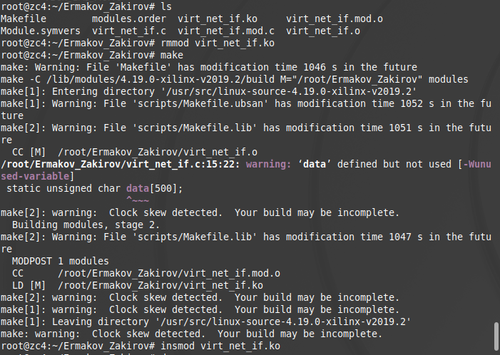
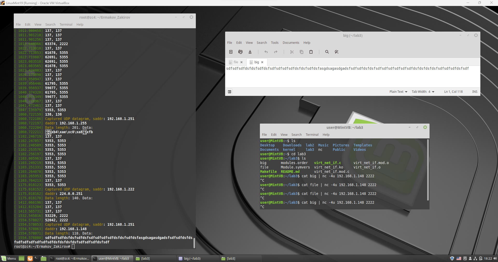

# Лабораторная работа 3

**Название:** "Разработка драйверов сетевых устройств"

**Вариант**: 1

**Выполнили:** Ермаков Тимофей, Закиров Тимур, гр. P33092

**Цель работы:** получить знания и навыки разработки драйверов сетевых интерфейсов для операционной системы Linux.

## Описание функциональности драйвера

Драйвер создаёт виртуальный сетевой интерфейс в ОС Linux.

Созданный сетевой интерфейс должен перехватывать пакеты родительского интерфейса (eth0 или другого).

Сетевой интерфейс реализует логику работы с перехваченным трафиком следующим образом: перехватываются UDP пакеты длиной больше 100 байт и выводится их длина в кольцевой 
буфер ядра.

## Инструкция по сборке

Сборка и загрузка драйвера в ОС:

```
make all
sudo su
insmod virt_net_if.ko
```

Удаление и очистка:
```
rmmod virt_net_if.ko
make clean
```

## Инструкция пользователя

```
cat big | nc -4u 192.168.1.75 2222

dmesg
```

## Примеры использования

Сборка и загрузка:



Использование: на скриншоте в терминале выделено сообщение о длине перехваченного пакета - 118 символов (>100), в окне справа сверху длина сообщения 118 символов. 


